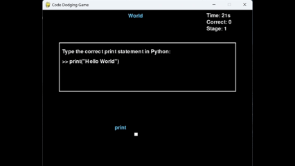

# Python Hello World Game

## 概要
このゲームは弾幕（コードの一部）を避けながら、攻撃として落ちてくる文字列を表した、print("Hello World")を途中で入力しながら最後まで生き延びるゲームです。

## ゲームステージ

### Stage 1


### Stage 2


### Stage 3


### Stage 4


---
## 始め方
このゲームを遊ぶには``` python ```環境と```pygame```が必要です。
1. python環境を準備してください
2. ターミナルで```pip install requirements.txt```を実行
3. ターミナルで```python game.py```を実行

---
### 隠し要素
このゲームには無敵になれるadminモードがあります。

### **IDE風自動補完**
- `(`を入力すると自動で`)`を追加
- `"`を入力すると自動で`"`を追加
- カーソル位置も自動調整